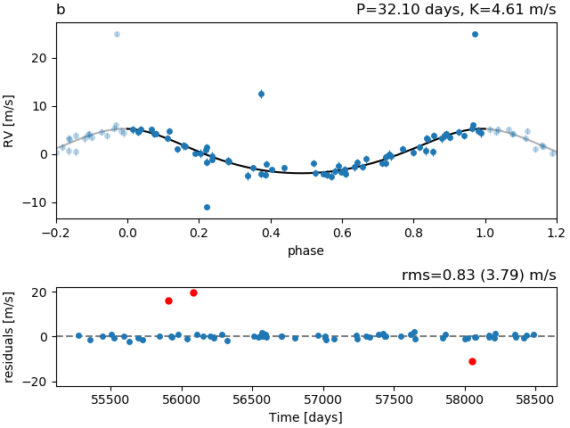

This is a cool example showcasing the use of a Student t likelihood for more
robustness regarding outlier RV measurements. The folder contains a simulated
dataset with known outliers and a planetary signal. 

The `kima_setup.cpp` file sets the main options for the model, including

```c++
const bool studentt = true;
```

This introduces an additional parameter in the model, the degrees of freedom of
the Student t likelihood (called `nu` in the code).

The number of planets in the model is fixed to 1 and the example uses default
priors for all parameters. The default prior for `nu` is a log-uniform
distribution between 2 and 1000. Note that the variance of the t-distribution is
infinite for 1 < `nu` <= 2. Larger values for `nu` make the t-distribution
approach a Gaussian distribution.



--- 

To compile and run, type

```
kima-run
```

With the default options, this example should take about a minute to finish.

It's interesting to set `studentt = false` in order to check the nasty effect of
the outliers on the Gaussian distribution.